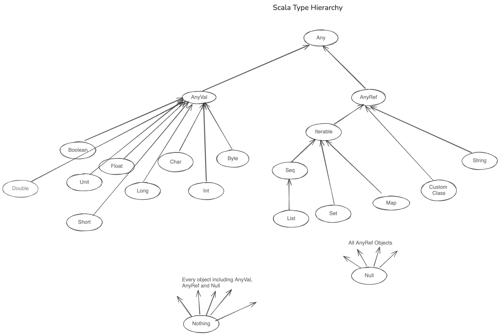

# Scala Type Hierarchy

In Scala, every value has a type associated with it and every type is a subtype of `Any`. In Scala, there are no primitives like in Java. Everything is an object.

## Type Hierarchy Overview

Below figure shows Scala type hierarchy in brief. There are also other different types of `Seq`, `Map` in the type hierarchy but those are excluded to keep it simple.



At the top of the hierarchy we have `Any` which is a super type of all types in Scala. `Any` has two direct subclasses: `AnyVal` and `AnyRef`.

### `AnyVal`
`AnyVal` is a super type of all value types in Scala. Value types are types that are represented as primitive types 
in Java. Examples of value types are `Int`, `Float`, `Double`, `Boolean`, `Char`, `Byte`, `Short` and `Long`. They have primitive equivalents in Java language. These types are usually passed by value in method or function calls. You will learn more about what pass by value means in upcoming lessons.

All value types are extended from `AnyVal` which in turn is extended from `Any`. Each of these value types have their equivalent rich classes in Scala. For example, `Int` has `RichInt`, `Float` has `RichFloat`, `Double` has `RichDouble` etc. These rich classes provide additional methods to the value types and makes them lot more convenient to work with in Scala. The `Double` type is implicitly converted into `RichDouble` when you call a method that is not available on `Double` type. You will learn more about implicit conversions in upcoming lessons. It's not important to know at the moment. It's just enough to know that value types have rich classes that provide additional methods.

### `AnyRef`
`AnyRef` is a super class of all reference types in Scala. Reference types are types that are represented as objects in Java. Examples of reference types are `String`, `List`, `Map`, `Array`, `Set` etc. They are usually stored on the heap memory and are usually passed by reference in method or function calls.

### `Null` and `Nothing`
`Null` is a subtype of all reference types in Scala. It is used to represent a null value. It is not recommended to use `null` in Scala. Instead you should use `Option` type to represent a value that may or may not be present.

`Nothing` is a subtype of all types in Scala. It is used to represent that a method or function does not return a value. It is also used to represent that a method or function throws an exception.

### `Unit`

Scala also has a special type called `Unit` which is similar to `void` in Java. The `Unit` can laos be represented 
as empty pair of parentheses `()`. It's used to represent that a method or a function does not return any value.
It is used to 
represent that a 
method or function does not return a value. 

## Practical Examples

As you can see from above code, you can assign any of the `AnyVal` to variable of type `Any`. This is because `Any` is a super type of all types in Scala.

```scala
var any: Any = 42
println(any)

any = "Hello"
println(any)

any = true
println(any)

any = 3.14
println(any)
```

If you convert the variable to `AnyVal`, you will see error while assigning `String` to `AnyVal` because `String` is a reference type and `AnyVal` is a value type.

```scala
var any: AnyVal = 42
println(any)

// any = "Hello" // error: type mismatch

any = true
println(any)

any = 3.14
println(any)
```

Due to the implicit conversion to Rich data type, you can easily convert value of one type to another.

```scala
val x: Int = 42
x.doubleValue()
x.floatValue()

val y: Double = 3.14
y.intValue()

y.longValue()
y.floatValue()
```

Each value type is actually a class, so we can also invoke methods on those value types to convert to other data types.

```scala
val x: Int = 42
x.toLong()

x.toDouble()
x.toFloat()
```

You can convert any value to a string using `toString` method.

```scala
val x: Int = 42
x.toString()

val y: Double = 3.14
y.toString()
```

## Get Type of a Value

Scala also provides rich set of methods for getting the type of a value or to check if a value is of a particular type.

- You can use `getClass` method to get the type of a value.

```scala
val greeting: String = "Hello"
println(greeting.getClass) // class java.lang.String

val number: Int = 42
println(number.getClass) // int
```

- You can use `isInstanceOf` method to check if a value is of a particular type. This can be used to verify if a value is of a particular type before performing any operation on it.

```scala
val greeting = "Hello"
println(greeting.isInstanceOf[String]) // true
```